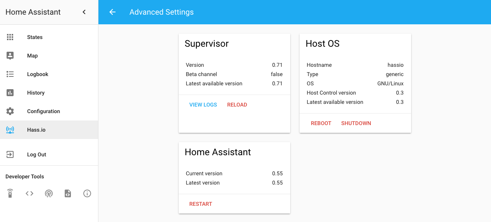
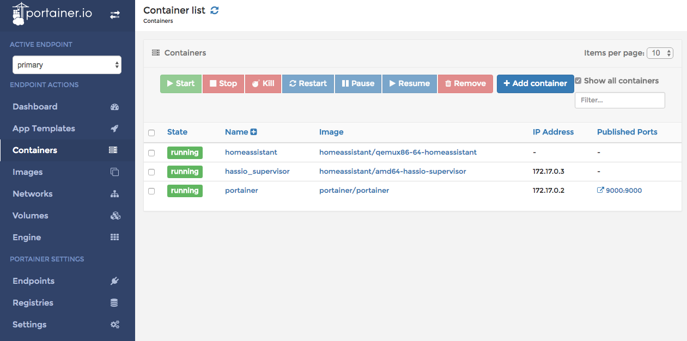
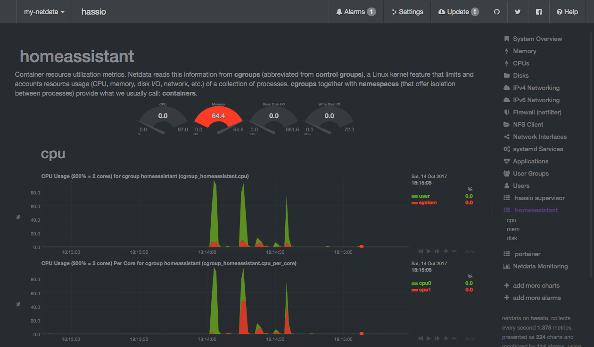

# Community Hass.io Add-ons: Vagrant

[![GitHub Release][releases-shield]][releases]
![Project Stage][project-stage-shield]
[![License][license-shield]](LICENSE.md)

[![Code Climate][codeclimate-shield]][codeclimate]
![Project Maintenance][maintenance-shield]
[![GitHub Activity][commits-shield]][commits]

[![Bountysource][bountysource-shield]][bountysource]
[![Discord][discord-shield]][discord]
[![Community Forum][forum-shield]][forum]

[![Buy me a coffee][buymeacoffee-shield]][buymeacoffee]

This Vagrant box contains [Home Assistant][home-assistant], which is
based on Hass.io.

## About

This Vagrant virtual machine allows you to test and play with Hass.io and
Home Assistant, and is a great environment for add-on developers. A simple
`vagrant up` command gives you a fully-installed Hass.io system
in a couple of minutes.



This setup comes preloaded with [netdata][] and [Portainer][portainer] to
provide you even more insight into what is happening under the hood of your VM.

### Portainer

Portainer is a lightweight Docker management UI which allows you to easily
manage your Docker/Hass.io host.

It allows add-on developers to look at the logs of their add-on, or even
get a console into their running add-on, to allow for easy debugging issues.



### netdata

netdata allows you to monitor your Docker containers, which Hass.io is built on.
Simple. Effective. Awesome!

Unparalleled real-time insight into everything happening on your systems,
applications and add-ons with stunning, interactive web dashboards and
powerful performance and health alarms.

This gives add-on developers detailed information about the performance and
resource usage of their add-ons.



## System requirements

This setup does not require a lot. Sure it does cost some CPU & memory, but
to be honest, Google Chrome eats more memory these days.

This setup is tested on MacOS but should work fine on Linux as well. Windows
10 has been tested and is still experimental (please see notes below).

When following the installation instructions of the tools mentioned in the
following chapter, please be sure to check the system requirements of each of
those tools.

## Getting started

Before launching your Hass.io environment, you must install
[VirtualBox][virtualbox] 5.1 or higher INCLUDING the VirtualBox Extension Pack,
as well as [Vagrant][vagrant] 2.1.0 or higher. These software packages provide
easy-to-use visual installers for all popular operating systems
and are open source.

Once [VirtualBox][virtualbox] and [Vagrant][vagrant] have been installed,
install `hassio-vagrant` by simply cloning this repository. Consider cloning
the repository into a folder within your "home" directory.

In case you are running this on a Linux system, you'll need to install `nfsd`.
For example, on Ubuntu: `sudo apt-get install nfs-common nfs-kernel-server`.

Now the installation of this Vagrant machine:

```bash
# Goto your home directory
cd ~

# Clone this repository into a folder called `hassio`
git clone https://github.com/hassio-addons/hassio-vagrant.git hassio
```

You should check out a tagged version of `hassio-vagrant` since the `master`
branch may not always be stable. You can find the latest stable version on the
[GitHub Release Page][releases]:

```bash
# Change the directory to `hassio`
cd hassio

# Checkout the desired release
git checkout v1.2.0
````

Once you have cloned the `hassio-vagrant` repository, use the following
command to start Hass.io:

```bash
vagrant up hassio
```

After 10 minutes or so, the process should finish and the following messages
will appear on your screen:

```txt
==> hassio: [INFO] Start services
==> hassio: =====================================================================
==> hassio:  Community Hass.io Add-ons: Vagrant
==> hassio:
==> hassio:  Hass.io is installed & started! It may take a couple of minutes
==> hassio:  before it is actually responding/available.
==> hassio:
==> hassio:  Home Assitant is running on the following links:
==> hassio:   - http://172.28.128.11:8123
==> hassio:   - http://192.168.1.2:8123
==> hassio:
==> hassio:  Portainer is running on the following links:
==> hassio:   - http://172.28.128.11:9000
==> hassio:   - http://192.168.1.2:9000
==> hassio:
==> hassio:  Netdata is providing awesome stats on these links:
==> hassio:   - http://172.28.128.11:19999
==> hassio:   - http://192.168.1.2:19999
==> hassio: =====================================================================
==> hassio:
==> hassio: Machine 'hassio' has a post `vagrant up` message. This is a message
==> hassio: from the creator of the Vagrantfile, and not from Vagrant itself:
==> hassio:
==> hassio: Hass.io starting... wait a couple of minutes!
```

:tada: Congratulations! Happy testing/developing :smile:

Note: _The links and IP addresses are examples, yours may differ and change
each time you run this virtual machine_

## Managing the virtual machine

If you followed the above procedure, you have Hass.io up and running.
But there may be a time where you need to shut it down, start up again or
maybe start over again.

Shutting down the virtual machine:

```bash
vagrant halt hassio
```

Starting/Resuming the virtual machine again:

```bash
vagrant up hassio
```

Destroying/Deleting the virtual machine:

```bash
vagrant destroy hassio
```

After you've destroyed your Hass.io virtual machine, you can use the
start command to create a fresh one.

Note: _Please, be aware! Destroying the machine would make you lose your
configuration of Home Assistant!_

You can also SSH into the virtual machine, giving you direct access
to the Docker host:

```bash
vagrant ssh hassio
```

## Shared folders

After starting the Hass.io virtual machine, some folders on your hard drive
will be made available. These are shared folders with your Hass.io virtual
machine. As files within these folders are changed, they will be kept in
sync between your local machine and the Hass.io virtual environment.

The following folders are provided within the location where you have cloned
this repository to:

- `addons` - May contain local add-on (e.g. for development).
- `backup` - May contain snapshots made with Hass.io.
- `config` - Contains the Home Assistant configuration.
- `share` - Cross add-on shared folder.
- `ssl` - May contain SSL certificate files.

Note: _When destroying the Hass.io virtual machine, the contents of the
`config` folder WILL BE DELETED. All other folders are left untouched._

## Configuration

This Vagrant box ships with a small configuration file, `configuration.yml`,
that allows you to tweak some settings of the virtual machine.

### `memory`

The number of megabytes of memory you want to give to the virtual machine.
By default, this has been set to 1024Mb. This number is pretty low, but
enough for most add-on development and ensures this setup can be run on
almost any machine. Feel free to upgrade the memory if you have spare.

### `cpus`

The number of CPU cores to give to the virtual machine. Defaults to 2.

### `hostname`

The hostname of the virtual Hass.io machine. Defaults to `hassio`. It might
be wise to change this, in case you already have a Hass.io device in your
network.

### `bridge`

Allows you to define the specific network interface to bridge to. By default, this
is set to `~`, which is the same as _nothing set_ and causes Vagrant
to ask you for the network interface to use each time you start the virtual
machine.

### `keep_config`

By default, if you destroy the virtual machine, the Home Assistant
configuration is removed automatically as well. This is to ensure you
have a fresh start each time you start the virtual machine.

However, if you need to keep the configuration on the destruction of
the virtual machine, you can simply set this option to `true`.

## Notes for Windows Users

Please ensure you run all vagrant commands from Powershell. The `Vagrant up`
command will prompt you to install the NFS addon, which is highly recommended.
You can continue using SMB, but will likely encounter performance issues.
This has only been tested using Windows 10 (1803), previous Windows versions
may work, feedback is welcomed.

When using the NFS addon, the winnfsd.exe process may not terminate on a halt
command.  This should be killed manually (Task Manager or your preferred method)
prior to issuing a `Vagrant Up`.

## Changelog & Releases

This repository keeps a change log using [GitHub's releases][releases]
functionality. The format of the log is based on
[Keep a Changelog][keepchangelog].

Releases are based on [Semantic Versioning][semver], and use the format
of ``MAJOR.MINOR.PATCH``. In a nutshell, the version will be incremented
based on the following:

- ``MAJOR``: Incompatible or major changes.
- ``MINOR``: Backwards-compatible new features and enhancements.
- ``PATCH``: Backwards-compatible bugfixes and package updates.

## Support

Got questions?

You have several options to get them answered:

- The Home Assistant [Community Forum][forum], we have a
  [dedicated topic][forum] on that forum regarding this repository.
- The Home Assistant [Discord Chat Server][discord] for general Home Assistant
  discussions and questions.
- Join the [Reddit subreddit][reddit] in [/r/homeassistant][reddit]

You could also [open an issue here][issue] GitHub.

## Contributing

This is an active open-source project. We are always open to people who want to
use the code or contribute to it.

We have set up a separate document containing our
[contribution guidelines](CONTRIBUTING.md).

Thank you for being involved! :heart_eyes:

## Authors & contributors

The original setup of this repository is by [Franck Nijhof][frenck].

For a full list of all authors and contributors,
check [the contributor's page][contributors].

## We have got some Hass.io add-ons for you

Want some more functionality to your Hass.io Home Assistant instance?

We have created multiple add-ons for Hass.io. For a full list, check out
our [GitHub Repository][repository].

## License

MIT License

Copyright (c) 2017 Franck Nijhof

Permission is hereby granted, free of charge, to any person obtaining a copy
of this software and associated documentation files (the "Software"), to deal
in the Software without restriction, including without limitation the rights
to use, copy, modify, merge, publish, distribute, sublicense, and/or sell
copies of the Software, and to permit persons to whom the Software is
furnished to do so, subject to the following conditions:

The above copyright notice and this permission notice shall be included in all
copies or substantial portions of the Software.

THE SOFTWARE IS PROVIDED "AS IS", WITHOUT WARRANTY OF ANY KIND, EXPRESS OR
IMPLIED, INCLUDING BUT NOT LIMITED TO THE WARRANTIES OF MERCHANTABILITY,
FITNESS FOR A PARTICULAR PURPOSE AND NONINFRINGEMENT. IN NO EVENT SHALL THE
AUTHORS OR COPYRIGHT HOLDERS BE LIABLE FOR ANY CLAIM, DAMAGES OR OTHER
LIABILITY, WHETHER IN AN ACTION OF CONTRACT, TORT OR OTHERWISE, ARISING FROM,
OUT OF OR IN CONNECTION WITH THE SOFTWARE OR THE USE OR OTHER DEALINGS IN THE
SOFTWARE.

[bountysource-shield]: https://img.shields.io/bountysource/team/hassio-addons/activity.svg
[bountysource]: https://www.bountysource.com/teams/hassio-addons/issues
[buymeacoffee-shield]: https://www.buymeacoffee.com/assets/img/guidelines/download-assets-sm-2.svg
[buymeacoffee]: https://www.buymeacoffee.com/frenck
[codeclimate-shield]: https://img.shields.io/badge/code%20climate-protected-brightgreen.svg
[codeclimate]: https://codeclimate.com/github/hassio-addons/hassio-vagrant
[commits-shield]: https://img.shields.io/github/commit-activity/y/hassio-addons/addon-ssh.svg
[commits]: https://github.com/hassio-addons/addon-ssh/commits/master
[contributors]: https://github.com/hassio-addons/hassio-vagrant/graphs/contributors
[discord-shield]: https://img.shields.io/discord/330944238910963714.svg
[discord]: https://discord.gg/c5DvZ4e
[downloads-shield]: https://img.shields.io/github/downloads/hassio-addons/hassio-vagrant/total.svg
[forum-shield]: https://img.shields.io/badge/community-forum-brightgreen.svg
[forum]: https://community.home-assistant.io/t/repository-community-hass-io-add-ons/24705?u=frenck
[frenck]: https://github.com/frenck
[home-assistant]: https://home-assistant.io/
[issue]: https://github.com/hassio-addons/hassio-vagrant/issues
[keepchangelog]: http://keepachangelog.com/en/1.0.0/
[license-shield]: https://img.shields.io/github/license/hassio-addons/hassio-vagrant.svg
[maintenance-shield]: https://img.shields.io/maintenance/yes/2018.svg
[netdata]: https://my-netdata.io
[portainer]: https://portainer.io
[project-stage-shield]: https://img.shields.io/badge/project%20stage-production%20ready-brightgreen.svg
[reddit]: https://reddit.com/r/homeassistant
[releases-shield]: https://img.shields.io/github/release/hassio-addons/hassio-vagrant.svg
[releases]: https://github.com/hassio-addons/hassio-vagrant/releases
[repository]: https://github.com/hassio-addons/repository
[semver]: http://semver.org/spec/v2.0.0.html
[vagrant]: https://www.vagrantup.com/
[virtualbox]: https://www.virtualbox.org/
